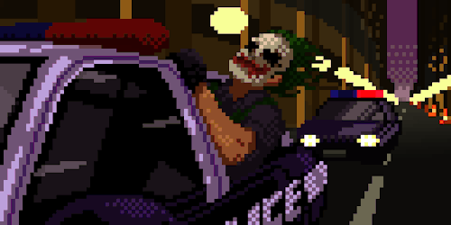

# 🖐️ Finger Mouse — Gesture Controlled Virtual Touchpad

<p align="center">
  
</p>

A real-time computer vision project that turns your webcam into a **gesture-controlled virtual touchpad**.
Control your mouse cursor, clicks, drag-and-drop, and scrolling using only your hand.

Built with **MediaPipe + OpenCV + PyAutoGUI**.

---

# 🚀 Features

* ✅ Real-time hand tracking (21 landmarks)
* ✅ Smooth cursor control with finger movement
* ✅ Left click gesture
* ✅ Right click gesture
* ✅ Drag & drop gesture
* ✅ Two-finger scroll gesture
* ✅ Cursor smoothing & jitter reduction
* ✅ ROI control area for stability
* ✅ Gesture conflict protection
* ✅ Auto drag-release safety
* ✅ FPS display overlay

---

# 🧠 Tech Stack

* Python
* OpenCV
* MediaPipe Hands
* PyAutoGUI
* NumPy

---

# 📦 Installation

## 1️⃣ Clone repo

```bash
git clone https://github.com/Godgiftedevil/finger-mouse.git
cd finger-mouse
```

## 2️⃣ Install dependencies

```bash
pip install opencv-python mediapipe pyautogui numpy
```

---

# ▶️ Run

```bash
python finger_mouse_final.py
```

Press **Q** to quit.

---

# 🎮 Controls (Gestures)

## 🖱 Cursor Move

Move your **index finger** inside the purple box → cursor moves.

---

## 👆 Left Click

Pinch **thumb + index finger** briefly.

---

## 👉 Right Click

Pinch **thumb + middle finger** briefly.

---

## ✊ Drag & Drop

Hold **thumb + index finger pinch** for a short time → drag starts.
Release fingers → drag ends.

---

## ✌️ Scroll

Keep fingers open (index + middle extended) and move hand up/down → scroll.

---

# 📐 Control Area

* Only movement inside the **purple rectangle** controls the cursor.
* This prevents edge jitter and accidental jumps.

---

# ⚠️ Safety

* PyAutoGUI failsafe enabled — move mouse to top-left corner to stop.
* Drag auto-releases if hand disappears.
* Drag auto-releases if hand leaves control area.

---

# 🧪 Tested On

* Laptop webcam
* USB webcam
* Windows Python environment

---

# 📌 Limitations

* Works best in good lighting
* Single-hand tracking only
* Very fast motion may reduce accuracy
* Background clutter can affect detection

---

# 🚀 Future Improvements

* Settings GUI
* Gesture calibration
* Sensitivity controls
* Multi-monitor support
* Custom gesture mapping

---

# 👨‍💻 Author

Built as a computer vision + human-computer interaction project using real-time hand tracking.

---

# ⭐ If you like this project

Star the repo and try extending it!
